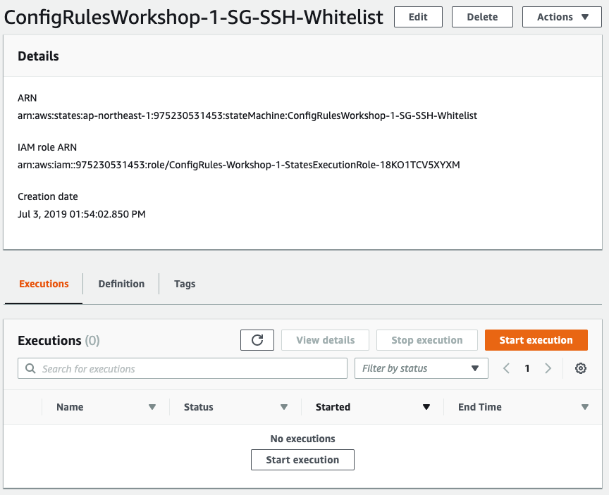
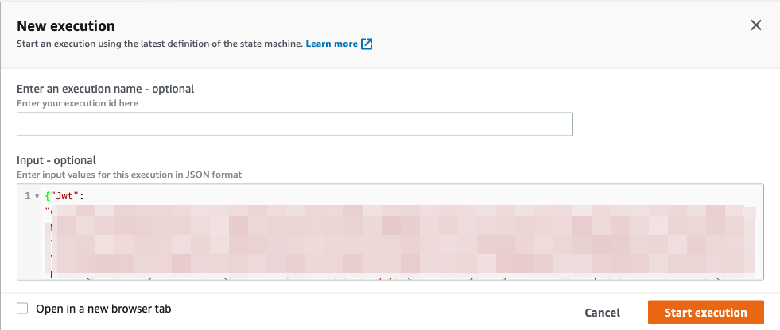

# Making Things Right With AWS Lambda and AWS Config Rules

## View the Leaderboard - https://d19r22d22bfa5a.cloudfront.net

This repository contains five partially completed AWS Lambda functions, written in Python, to be completed and used as AWS Config Rules when attending the “Making Things Right With AWS Lambda and AWS Config Rules” workshop.  

As part of the workshop, you will work in teams to complete the Lambda functions provided, and create AWS Config Rules with the completed functions so that they operate as described and appropriately mark AWS resources as Compliant or NonCompliant.

## Prerequisites
Each attendee must have the following in order to participate:

### 1. An AWS Account
Each participant must work within their own AWS account, with Admin privileges (you will be utilizing several different services while creating and testing your Config Rules, include creation of new IAM Roles and Policies).

Participants working on the same Config Rules Workshop team will complete rules within their own separate AWS accounts.

### 2. A Config Rules Workshop Leaderboard Account
We have created a Leaderboard Web Application where you can register and compete against the other teams attending your workshop. You will need to register with the leaderboard in order to test that your completed Config Rules are operating as described, and to earn your team points!

Find and register for the Workshop leaderboard [**here**](https://d19r22d22bfa5a.cloudfront.net)

Once registered, Create or Join a Team with the group of workshop attendees you will be cooperating with to complete all of your custom AWS Config Rules.  You are welcome to work on your own team if you prefer. But in order to earn points, you must still Create a Team, even if you are the team's only member.

## How it Works

### Repository Contents
Within the [**Workshop Rules**](/Workshop-Rules) directory, you will find the content required to complete the workshop. There is no requirement to complete the modules in order, but Module 1 contains an introduction and overview for both AWS Config Rules and step-by-step instructions for earning points as you complete modules.  We recommend you begin with Module 1 before proceeding.  The modules generally increase in difficulty, Module 1 containing a fully-written Lambda function, and Module 5 requiring the most code to be complete.  

Within each Workshop Module, you will find the following 3 files:
1. **rule.py** -  This is a partially completed Lambda function that has been written to serve as a Config rule once completed.  The README within the directory will describe the intended purpose of the function and provide hints and links to documentation to point you towards completion.  Within `rule.py`, from Module 2 onwards, you will find snippets and lines of code that have been marked as `##CHANGED##` or `##LINE_REMOVED##`.  You will need to replace those values or lines of code with the correct values or logic in order for the rule to behave appropriately.  **Some of the removal comments include hints about what's missing.**
2. **compliant_test_event.json** - A json object that can be used within the Lambda console as a test event to see if your code will successfully have marked the event as COMPLIANT.  An added parameter has been appended to the object `dryRun=true` which is then again referenced within the completed function code to allow for more testing without AWS Config needing to be called, like would occur with a non-test event.
3. **noncompliant_test_event.json** - A json object that can be used within the Lambda console as a test event to see if your code will successfully have marked the event as NON_COMPLIANT.

### Testing Your Rule (earning points!)
After you have tested your Config Rule to your satisfaction for each module, you will find a button located within each Module directory to launch a CloudFormation stack.  This stack will create all of the resources required to test and assess the correctness of the Config Rule and Lambda function you've created.  Each assessment occurs as an **Execution** via an AWS Step Functions State Machine that is created by the CloudFormation template for that module.  Simply visit the [Step Functions console](https://console.aws.amazon.com/states/), select the created state machine for the module, and then choose **New Execution**:  

For the *Execution Input*, visit the [**Config Workshop Leaderboard**](https://amzn.to/aws-config-rules-workshop/), and after you have **Created or Joined a Team**, choose the **Copy JWT** button:  

If you do not join a team on the Leaderboard, you will not receive points! Take your copied JWT input, and replace the default State Machine input with all that's been copied as the input to the State Machine Execution:

The execution will take 5-10 minutes to complete, and it's path through the state machine will indicate if your Config Rule has met the requirements and if any points have been scored for your team!  A completed execution will look like the below (failure will result in a red failure state):

Each individual on your team can only receive points once for each rule.  But your team *can* receive points for the same rule as different team members complete each Module - **so help your team members complete their rules as well!**

## License

This library is licensed under the Apache 2.0 License.
